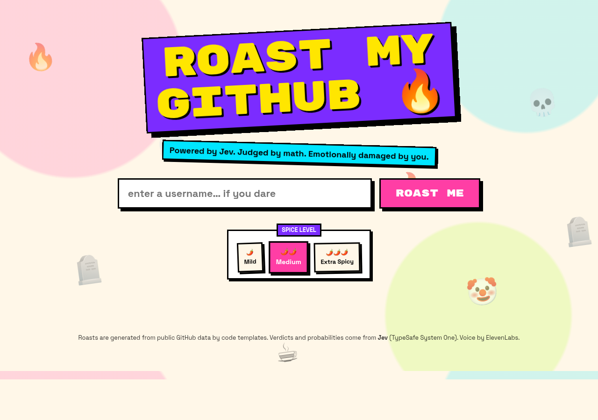

# ROAST MY GITHUB 🔥

Type a GitHub username, and calibrated AI verdicts from **Jev** turn your public commit habits into a savage (but good-natured) roast, read aloud by ElevenLabs.



## What it does

1. Pulls public GitHub data for the username (profile, repos, recent commits).
2. Computes hard facts in code: stale repos, untouched forks, night-owl commit %, lazy commit messages, missing descriptions, follower ratio, and more.
3. Sends all facts to **Jev (TypeSafe System One)** in a single request with five typed questions and gets back calibrated judgments plus probabilities.
4. Turns facts + verdicts into a 6–7 line roast using randomized code templates (no LLM writes the jokes) at three spice levels.
5. Speaks the roast with ElevenLabs while the lines animate karaoke-style. If ElevenLabs is unavailable, the browser's `speechSynthesis` takes over so the demo never goes silent.

Roasts target code and GitHub habits only — never anything personal.

## Setup and run

```bash
git clone https://github.com/Kevin20AP/roast-my-github.git
cd roast-my-github
pip install -r requirements.txt
cp .env.example .env    # fill in your keys
python app.py
```

Then open http://localhost:5000.

## Environment variables

| Name | Required | Notes |
| --- | --- | --- |
| `TYPESAFE_API_KEY` | yes | Jev / TypeSafe API key |
| `ELEVENLABS_API_KEY` | no | Without it the app falls back to browser speech |
| `GITHUB_TOKEN` | no | Public-read token; raises the GitHub rate limit from 60 to 5000 req/h |
| `ELEVENLABS_VOICE_ID` | no | Default `G0yjIg3xY8gEJZkHpjVm` (library voice, needs a paid plan) |
| `ELEVENLABS_FALLBACK_VOICE_ID` | no | Default `nPczCjzI2devNBz1zQrb`, a premade voice that works on free plans |
| `ELEVENLABS_MODEL_ID` | no | Default `eleven_flash_v2_5` (fast) |
| `PORT` | no | Default `5000` |

Keys are only ever read server-side. `.env` is gitignored — never commit real keys.

## How Jev powers this

Jev never writes a word of the roast. It returns typed, calibrated judgments with probabilities, which the template engine converts into jokes. All five questions go out in **one** `system_one` request (they run in parallel) with the GitHub facts passed as named JSON state.

| # | Primitive | Question | What it decides |
| --- | --- | --- | --- |
| 1 | Choice | Which developer archetype fits this GitHub account? (Graveyard Keeper, Tutorial Collector, Fork Hoarder, Midnight Gremlin, Commit Message Poet, Secretly Competent) | The trading-card archetype and the roast's closing line; the full probability map is shown as bars |
| 2 | Noul | Will this developer actually finish their next side project? | The big "finish %" gauge and a roast line |
| 3 | Score 1–5 | Project commitment (1 = abandons everything within weeks … 5 = maintains projects for years) | Flame bar rating and a roast line |
| 4 | Score 1–5 | Commit message quality (1 = "asdf"/"fix" … 5 = clear and descriptive) | Flame bar rating and a roast line |
| 5 | Choice | Which repo would a senior engineer find most embarrassing or most obviously abandoned? (top ~10 repos + a "none" option) | The tombstone: `R.I.P. {repo} — born … died … survived by n commits` |

Jev's confidence for every answer is displayed in the UI, so you can see the model's calibration, not just its opinion.

## API

| Route | Purpose |
| --- | --- |
| `GET /` | The app |
| `GET /api/health` | Liveness + which keys are configured |
| `POST /api/roast` | `{"username": "...", "spice": "mild\|medium\|spicy"}` → facts, Jev verdicts, roast lines, tombstone |
| `POST /api/voice` | `{"lines": [...]}` → `audio/mpeg` |

The last 10 roasts are cached in memory for 15 minutes so demo usernames load instantly.
